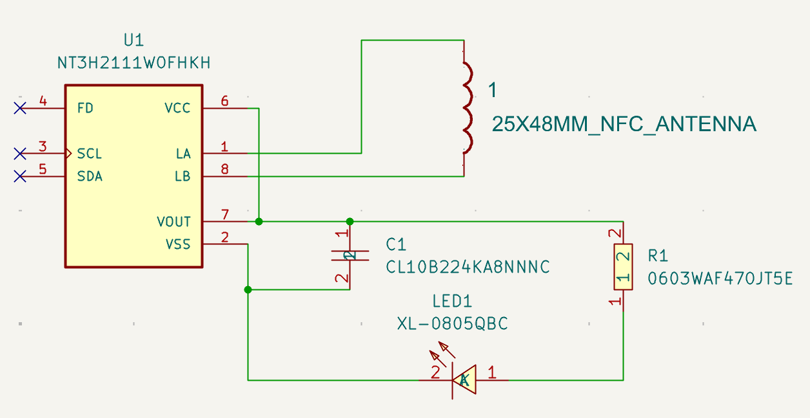
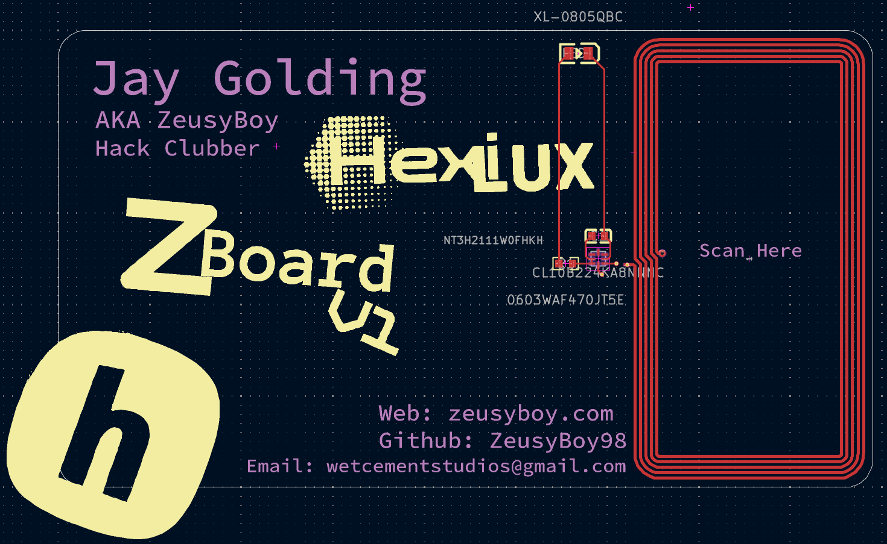
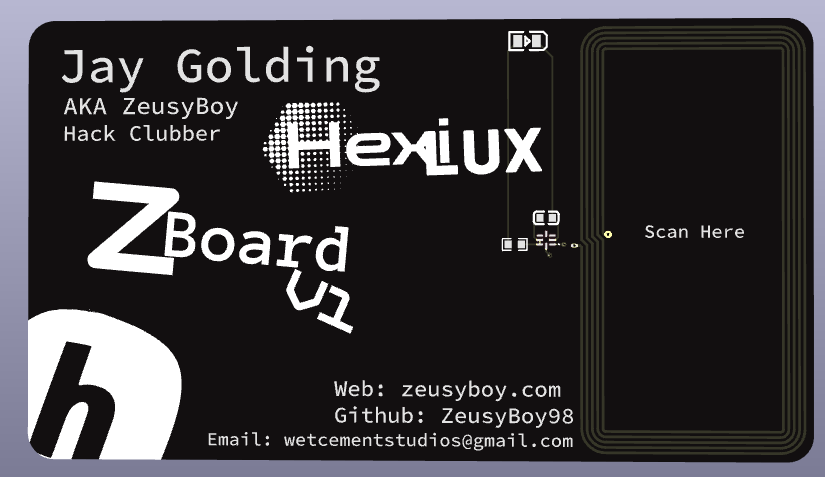

# ZeusyBoy Hacker Card
An NFC business card because it's cool I guess.
Made for Hack Club Fallout

## Zine
In progress.

## What does it do?
It's a business card which allows me to scan it on any phone and have my website/github appear, and it lights up and LED.

## Why/Motivation?
Because it would seem every other hack clubber has one and they're really cool and could help with industry networking.

## How?
In order to make this project for yourself, you'll need to purchase/3D print the items in the bill of materials below.

| Quantity | Item                     | URL                                                             | Unit Price ($USD) | Total Price ($USD)               |
|----------|--------------------------|-----------------------------------------------------------------|-------------------|----------------------------------|
| 5        | 220nf 25V                | https://jlcpcb.com/partdetail/21832-CL10B224KA8NNNC/C21120      | 0.0075            | 0.04                             |
| 5        | LED Blue 3.1V 5mA 100mcd | https://jlcpcb.com/partdetail/Hubei_KENTOElec-KT0805B/C2293     | 0.0121            | 0.06                             |
| 5        | 47Ω 100mW 75V            | https://jlcpcb.com/partdetail/23909-0603WAF470JT5E/C23182       | 0.0016            | 0.01                             |
| 5        | 3.3V 13.56MHz            | https://jlcpcb.com/partdetail/NxpSemicon-NT3H2111W0FHKH/C710403 | 0.7637            | 3.82                             |
|          | PCBA                     |                                                                 |                   | 26.09(Includes components & PCB) |
|          | Shipping                 |                                                                 |                   | 9.33                             |
| Total    |                          |                                                                 |                   | 35.42                            |

### Build Guide:

#### 1. Preparation 
Before starting, make sure you have:
<ul>
<li>The gerbers, pick and place files, and BOM, all available in this repository.
</ul>

#### 2. Ordering
Go to your PCB manufacturer of choice (Make sure they have PCBA) and follow their instructions on how to order, use the zipped gerbers and the bom.csv and positions.csv for the PCB and PCBA (all available in /PCB/production).

#### 3. Firmware
Now you need to initialize the chip:
<ul>
<li>Install an app with the capability to use custom NFC commands, such as NFC Tools IOS or NFC Tools Android. 
<li>Flash the NFC card with this Advanced NFC command, A2:03:E1:10:6D:00,A2:04:03:04:D8:00,A2:05:00:00:FE:00. 
<li>Write any link to the nfc chip
</ul>

Now you can scan this card on a phone and it should open a link to whatever you set it to!
Enjoy your Hacker Card!

## Designing

